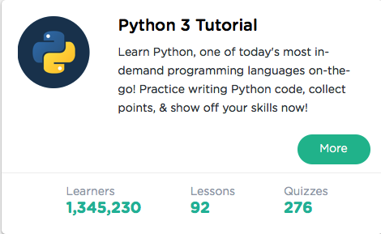

```
Roberto Nogueira  
BSd EE, MSd CE
Solution Integrator Experienced - Certified by Ericsson
```
# Sololearn Python



**About**

Learn everything you need to about the subject of this `Sololearn` project.

[Homepage](https://www.sololearn.com/Course/Python/)

## Topics
```
[x] Basic Concepts
[x] Control Structures
[x] Functions and Modules
[ ] Exceptions and Files
[ ] More Types
[ ] Functional Programming
[ ] Object-Oriented Programming
[ ] Regular Expressions
[ ] Pythonicness and Packaging
[ ] Certificate
```
